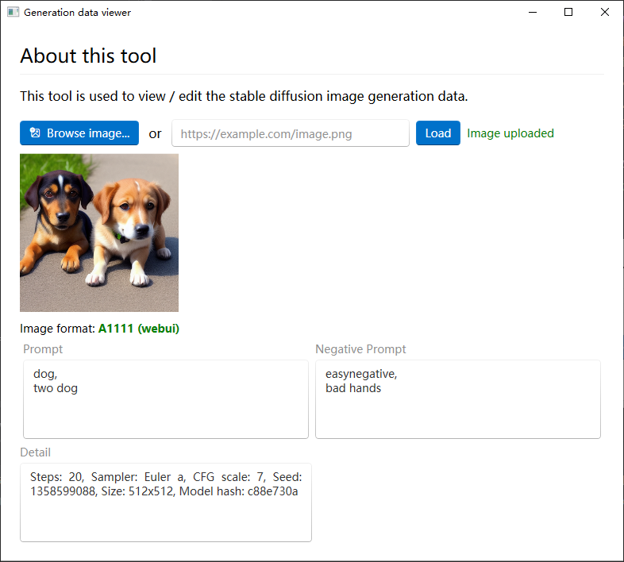

# GenerationDataViewer

Stable diffusion generation data viewer written in fluent ui.

Framework:

- .NET 8.0

Dependency:

- [WPF-UI](https://github.com/lepoco/wpfui)
- [ImageSharp](https://github.com/SixLabors/ImageSharp)

Features:

- [x] View A1111 (webui) generation data.
- [x] View ComfyUI generation data.
- [ ] Edit the generation data and save as.
